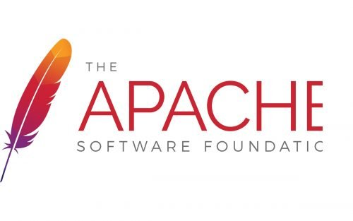
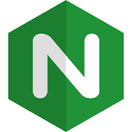
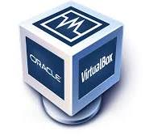
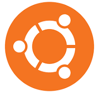

# Deliverable 1 

## Basic Terminology

### What is a web server?
A web server can refer to both the hardware and software that deliver web content to users. On the hardware side, it’s a computer that stores website files (HTML, CSS, etc.) and serves them over the internet. On the software side, it's the application (like Apache or Nginx) that processes requests (usually via HTTP) and sends back the appropriate web pages to users.

### What is Apache?
Apache  One of the most popular open-source web server programs is this one.  It enables users to host and serve web content, such as HTML pages and PHP programs, and is created and maintained by the Apache Software Foundation.  Apache is renowned for its modular architecture and adaptability.

### What is HTTP (HyperText Transfer Protocol)
The protocol web servers and browsers use to communicate. When you visit a site, your browser sends an HTTP request, and the server sends back an HTTP response.

### What is aemon
A background process that runs on Linux/Unix systems (like the Apache web server). It starts automatically and listens for connections or events.

### What is Ports (especially Port 80 and 443)
Port 80 is the default for HTTP, and 443 is for HTTPS (secure HTTP). Firewalls must allow these ports for a web server to be reachable.

### What is Configuration Files
Apache’s behavior is controlled through text-based config files, typically in `/etc/apache2/.` These include `apache2.conf,` `sites-available/, and sites-enabled/.`

### What are some example web server applications?

| Application Name | license                          | Project's Website               |
| ---------------- | -------------------------------- | ------------------------------- |
| Apache HTTP Server| Apache License 2.0	          | [apache.org](https://httpd.apache.org/) |
| Nginx	           | 2-clause BSD-like license        | [nginx.org](https://nginx.org/) |
| Lighttpd         | BSD license                      | [lighttpd.net](https://www.lighttpd.net/) |

#### Apache HTTP Server
 
Apache is highly configurable and supports a wide range of modules for added functionality, including SSL, URL rewriting, and virtual hosting.

#### Nginx
 
Nginx is known for high performance, stability, and low resource usage. It is often used for serving static files or as a reverse proxy/load balancer.

#### Lighttpd
 
Lighttpd is a lightweight web server designed for speed-critical environments and is ideal for servers with limited resources.

### What is virtualization?
Virtualization is the process of creating a virtual version of something, like an operating system or server, on top of existing hardware. It allows multiple systems to run independently on the same physical machine using software called a hypervisor.

### What is virtualbox?
 
VirtualBox is an open-source virtualization software developed by Oracle. It allows users to run multiple operating systems on a single physical machine by creating and managing virtual machines (VMs).

### What is a virtual machine?
A virtual machine (VM) is a software-based simulation of a physical computer. It runs an operating system and applications just like a real computer, but it's isolated from the host system and other VMs.

### What is Ubuntu Server?
 
Ubuntu Server is a server-focused version of the Ubuntu operating system. It’s free, open-source, and commonly used to run web, database, and file servers. It has no graphical interface by default, making it lightweight and ideal for cloud environments.

### What is a firewall?
A firewall is a security system that controls incoming and outgoing network traffic based on predefined rules. It acts as a barrier between a trusted network and untrusted networks, such as the internet, to prevent unauthorized access.

### What is SSH?
SSH (Secure Shell) is a cryptographic network protocol used to securely access and manage remote computers over an unsecured network. It encrypts data to protect login credentials and session activity, typically used to control remote servers.