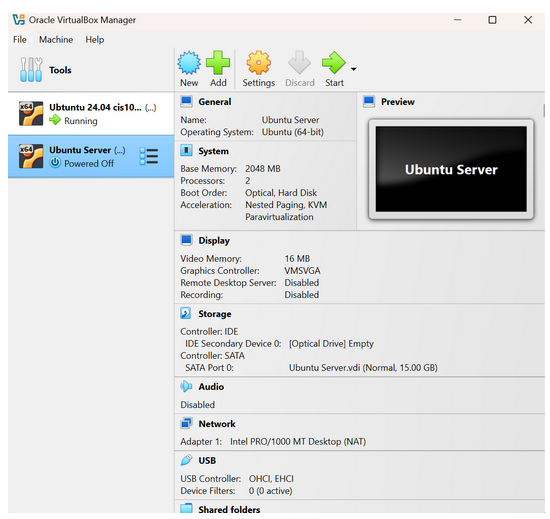
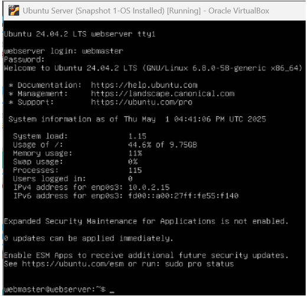
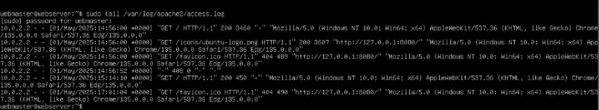
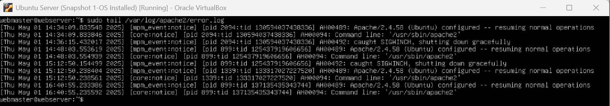

# Deliverable 2

## Server Specifications

## Ubuntu Login Screen

## Questions
3. **What is the IP address of your Ubuntu Server Virtual Machine?**
   IPv4 Address: 10.0.2.15
   
4. **How do you enable the Ubuntu Firewall?**
   `sudo ufw enable`
   
5. **How do you check if the Ubuntu Firewall is running?**
   `sudo ufw status`
   
6. **How do you disable the Ubuntu Firewall?**
   `sudo ufw disable`
   
7. **How do you add Apache to the Firewall?** 
   `sudo ufw allow 'Apache'`
   
8. **What is the command you used to install Apache?**
   `sudo apt update` `sudo apt install apache2 -y`
   
9.  **What is the command you use to check if Apache is running?**
    `sudo systemctl status apache2 `
    
10. **What is the command you use to stop Apache?**
    `sudo systemctl stop apache2`
    
11. **What is the command you use to restart Apache?**
    `sudo systemctl restart apache2`
    
12. **What is the command used to test Apache configuration?**
    `sudo apache2ctl configtest`
    
13. **What is the command used to check the installed version of Apache?**
    `apache2 -v`

14. **What are the most common commands to troubleshoot Apache errors? Provide a brief description of each command.**
* `sudo ufw status` 
  Ensure Apache traffic isn’t being blocked
* `sudo tail -f /var/log/apache2/error.log`
  Live view of Apache error log
    
1.  **Which are Apache Log Files, and what are they used for? Provide examples and screenshots.**
    this is a Apache Log `/var/log/apache2/`
* `access.log` All incoming HTTP requests (who accessed what and when)

* `sudo tail /var/log/apache2/error.log` All errors Apache encounters (useful for debugging)

