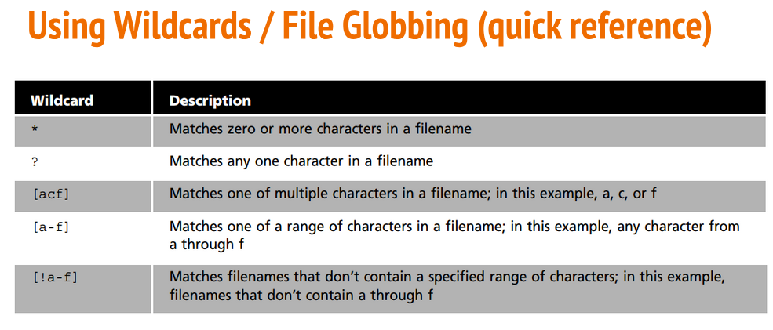

# Notes 6 

## * Wildcard 

* Matches 0 to any number of characters

### Examples:

* list all the txt files
 * `ls *.txt`

## ? Wildcard

* matches 1 character	 

### Examples:

* list all hidden files
*  `ls .??*` 

## [] Wildcard

matches 1 character from a set	

### Examples:

* matches 1 character from given set 
*  `ls f[aeiou]*`

## Brace Expansion

allows to generate arbitrary strings to use with commands 

### Examples:

* create a whole directory structure in a single command 
* `mkdir -p music/{jazz,rock}/{mp3files,videos,oggfiles}/new{1..3}`